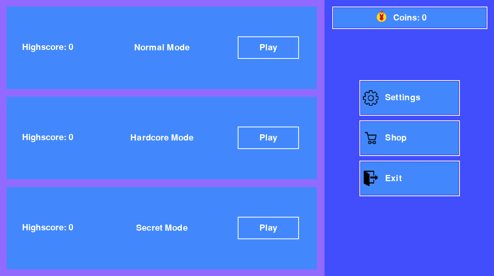
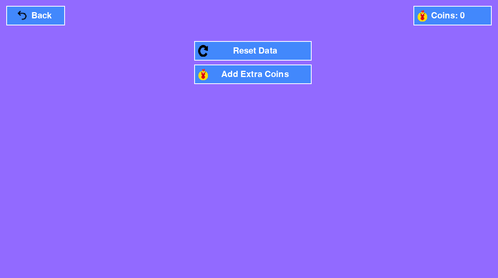
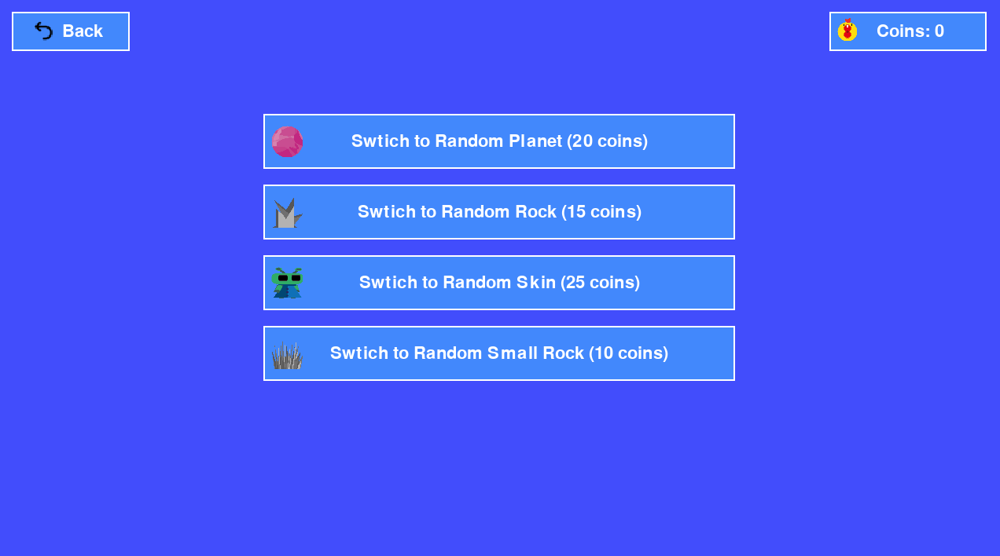
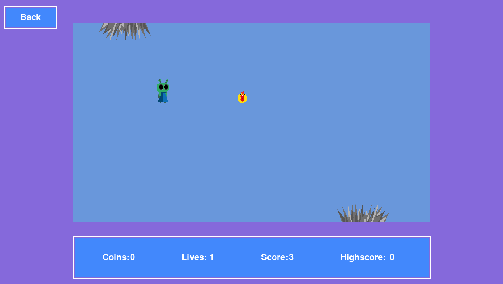
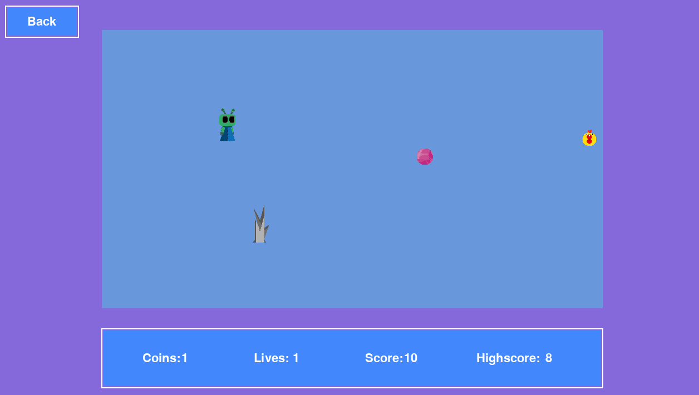
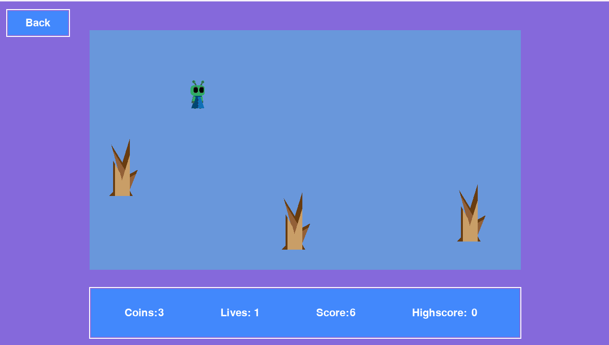
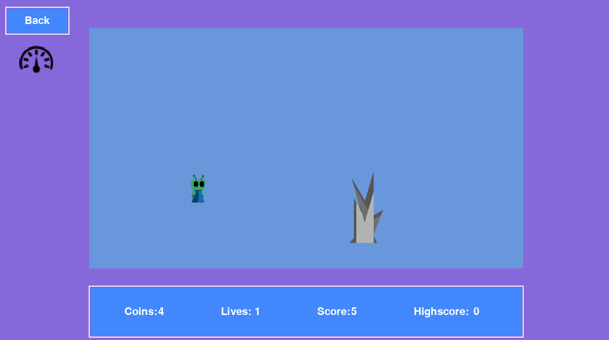
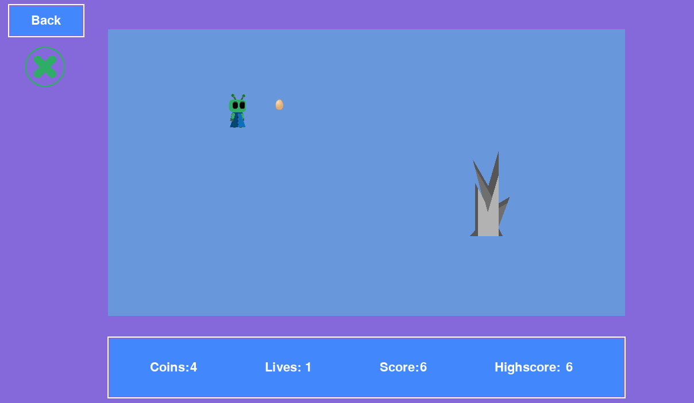
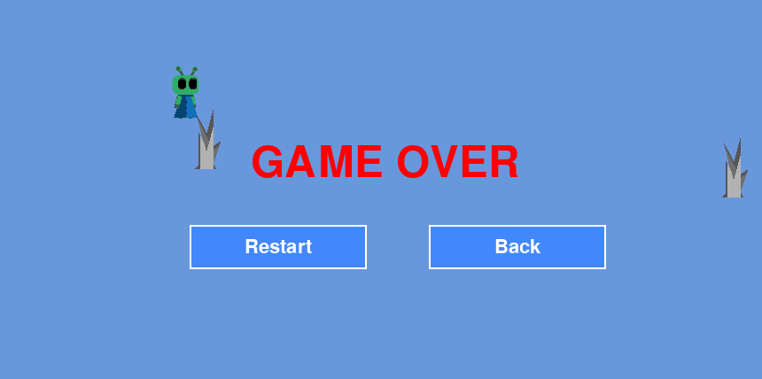

# Chicken Universe 2
**Description:**
Greetings :wave:, warrior :sunglasses:! It's your honor to gather magical chicks in space :space_invader: to save humanity :information_desk_person:. Dodge obstacles :cyclone: and increase :heavy_plus_sign: your high score :trophy:!
--
**Main Menu:**
Main Menu - It contains all the information :information_source: about game modes and allows you to navigate to settings and the store for additional options.

--
**Settings:**

--
**Shop:**

--
## Game Modes:
**Normal:**

**Hardcore:**

In Hardcore Mode, there is a massive debris that moves towards the player faster than in the normal mode.

**Secret mode:**

In this mode, the player collects not coins but eggs, each of which can provide various effects. Pay attention, the effects applied to the player can be understood through the effect icon displayed in the top left corner.

---

**Death menu:**

---
Enjoy the game and have a nice day!